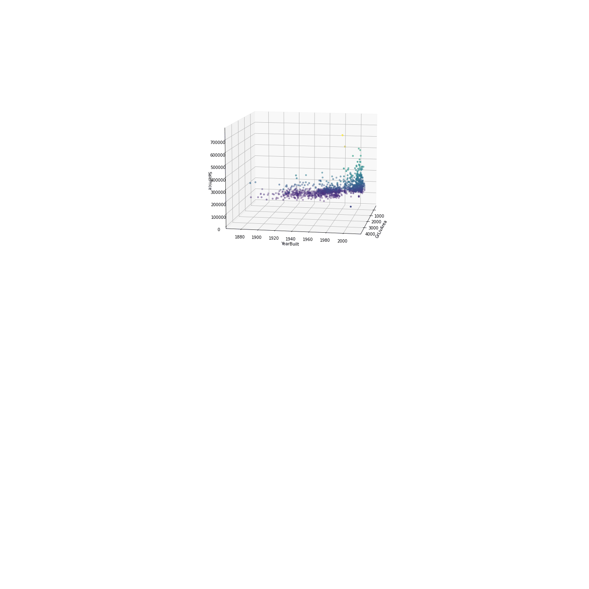

# Yam Arieli 😎
**`Software Engineer | Data Mining | Computer & Data Science Student`**

>Data analyst and Software engineer with significant practice in data analysis and passion for machine learning. 
A dean's list awarded Experienced with big projects leading and collaboration with colleagues. 
I'm a self-learner who believe that any skill is achievable with motivation and commitment.
<!---->

## Check out my projects from outside github 👇
<table style="width:80%">
  <tr>
    <th>Houses' Prices Prediction Kaggle 🏠</th>
    <th>RC Car with ESP32 🏎️</th>
    <th>Interactive maps with Python Short tutorial 🗺️</th>
  </tr>
  <tr>
      <td>
        
     </td>
    <td>
        
     </td>
        <td>
        
     </td>
  </tr>
</table>
                                                
>🔍💥 Let's explore data and ML togther!✌
<!---->
                                                                 
